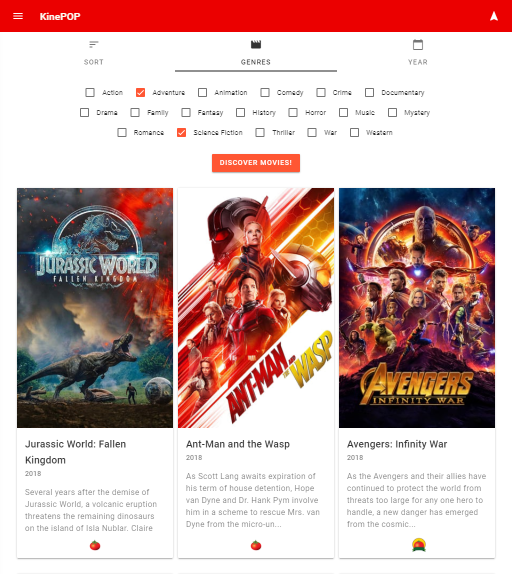
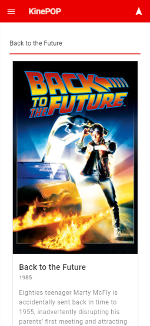

# [KinePOP &rtrie;](https://kine-pop.firebaseapp.com/)
> The movie search engine with the best recommendation algorithm in the world: you.

Why Kinepop?

I wanted to solve a problem. Everytime I had to choose a movie to see, I would spend ages. 

KinePOP allows me to scan movie posters quickly, examine actors/directors filmographies at light speed, and get a general feeling about the rating.  

But this isn't the only reason I built KinePOP. 

I wanted to **test my skills** and **apply what I learned** during the last 18 months. Was Redux essential for this project? No!

 I'm happy to introduce my project: this is Kinepop.

## Skills & Tools

* **React**

* **Redux** and **redux-thunk**

* **React-Router v4**

* **ES6**

* **React Material Web Components** [James Friedman](https://jamesmfriedman.github.io/rmwc/)

* **Firebase**

* **Axios**

* **Webpack, Babel** (bootstrapped with CRA)

## Screenshot

**KinePOP on iPad**



**KinePOP on iPhone X**



## Dependencies

* axios
* moment
* react 16.3.2
* react-dom 16.3.2
* react-redux 5.0.7
* react-router-dom 4.2.2
* react-scripts 1.1.4
* react-youtube 7.6.0
* redux 4.0.0
* redux-devtools 3.4.1
* redux-thunk 2.2.0
* rmwc 1.6.3
* uuid 

```sh
npm install
```

## Copyright and attribution

Copyright (c) 2018 Michele Paladino.